## Part 1.  Deploying your own k3s cluster

#### 1. Get a set of virtual machines for the cluster
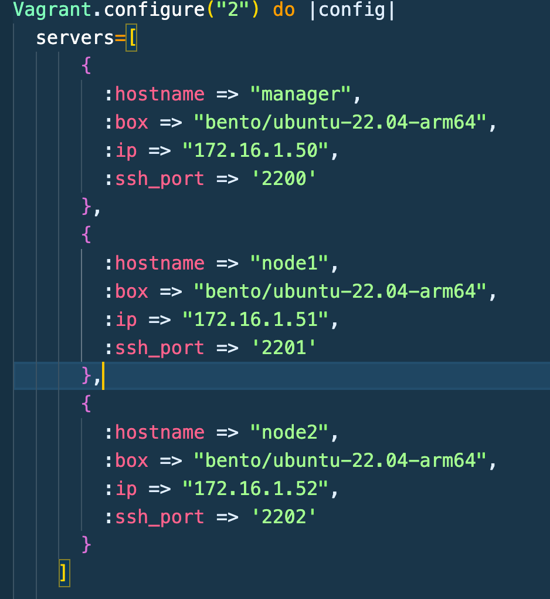

#### 2. Install k3s on all three machines. When installing, do not use the standard Ingress Controller by using the flag --disable=traefik
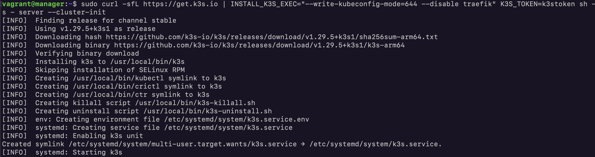
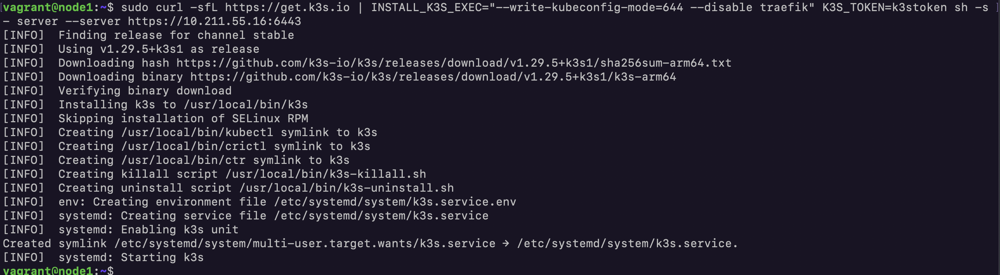
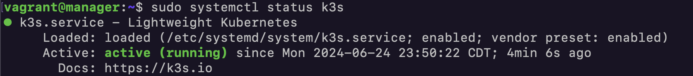

#### 3. Connect the nodes to the cluster using the k3s server command and the -token and --server flags for worker and master nodes respectively. When k3s is installed, the environment variable NODE_TOKEN can be used.
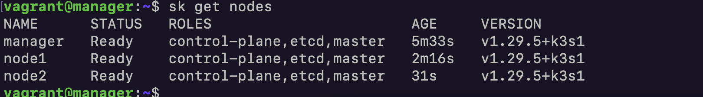

#### 4. Install the Ingress Controller Nginx instead of the default one. You can use the official nginx-based ingress controller manifest file available on GitHub.
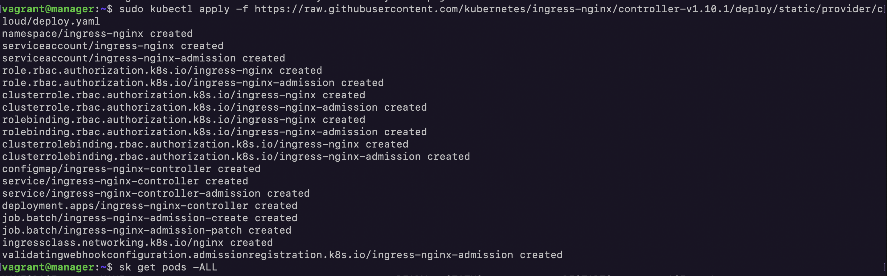
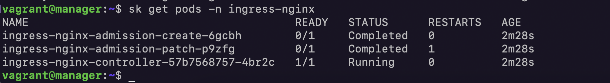

#### 4.1. I'll use metallb in order to get an exertnal ip address for my ingress service (bare-metal)
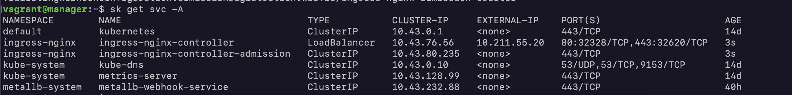
> Let's test it 

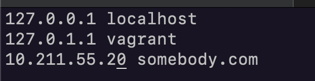
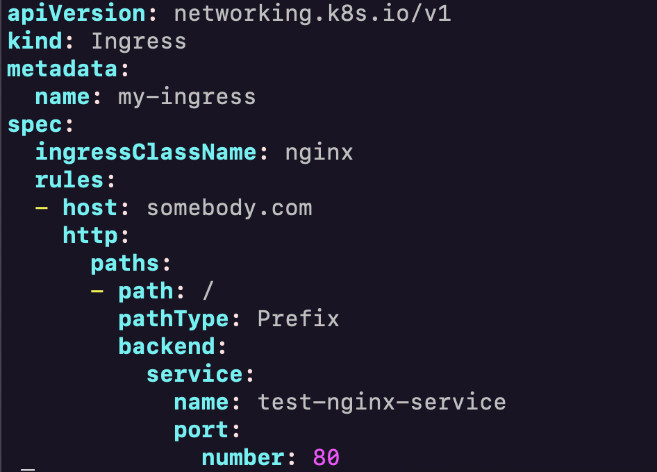
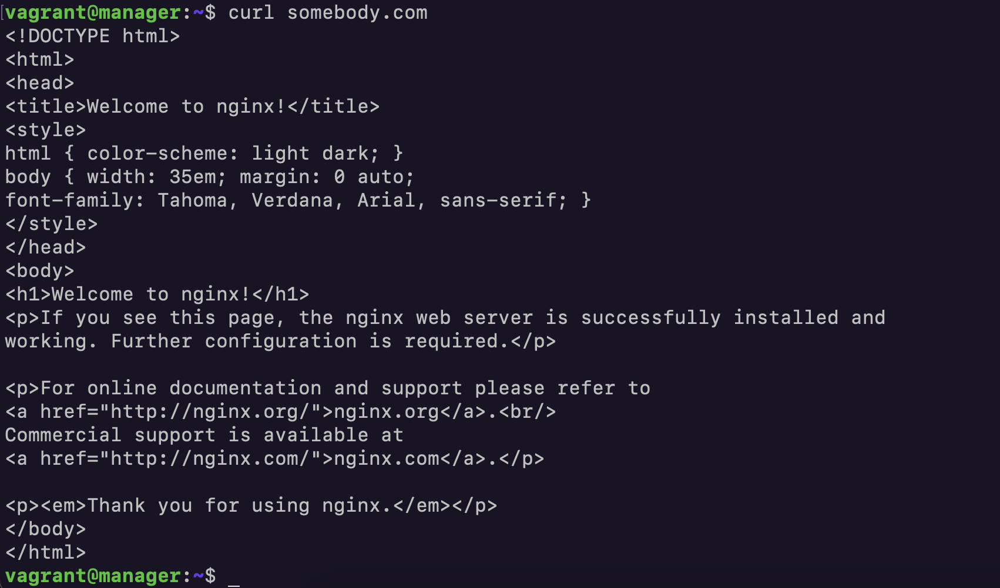
> You can find all configs in src/metallb directory  

#### 5. Get a domain name and configure the cert-manager utility inside the cluster, which should generate a wildcard certificate for the obtained domain
1. Create a Certificate Authority
    a. Create a CA private key
    ```bash
    openssl genrsa -out ca.key 4096
    ```
    b. Create a CA certificate
    ```bash
    openssl req -new -x509 -sha256 -days 365 -key ca.key -out ca.crt
    ```
    c. Import the CA certificate in the `trusted Root Ca store` of your clients
2. Convert the content of the key and crt to base64 oneline
    ```bash
    cat ca.crt | base64 -w 0
    cat ca.key | base64 -w 0
    ```
3. Create a secret object `nginx1-ca-secret.yml` and put in the key and crt content
4. Create a cluster issuer object `nginx1-clusterissuer.yml`
5. Create a new certificate `nginx1-cert.yml` for your projects
6. Add a `tls` reference in your ingress `nginx1-ingress.yml`
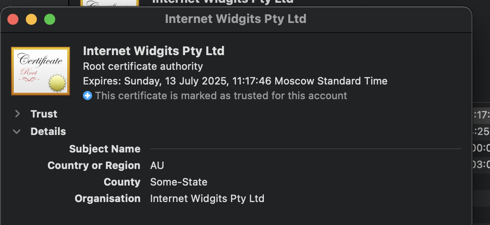
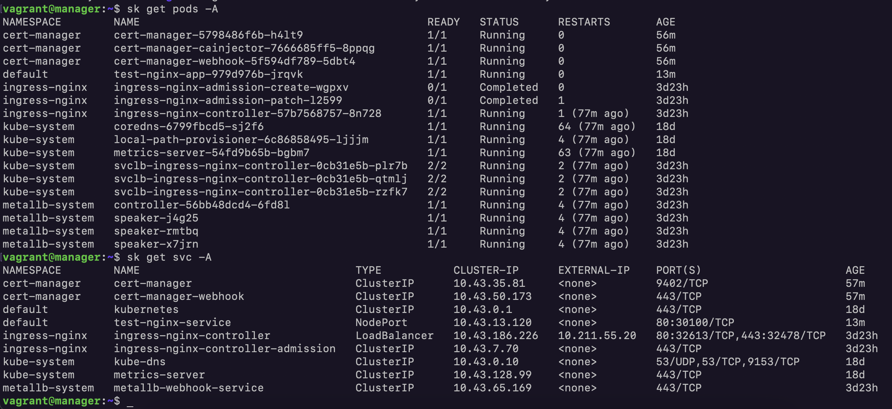
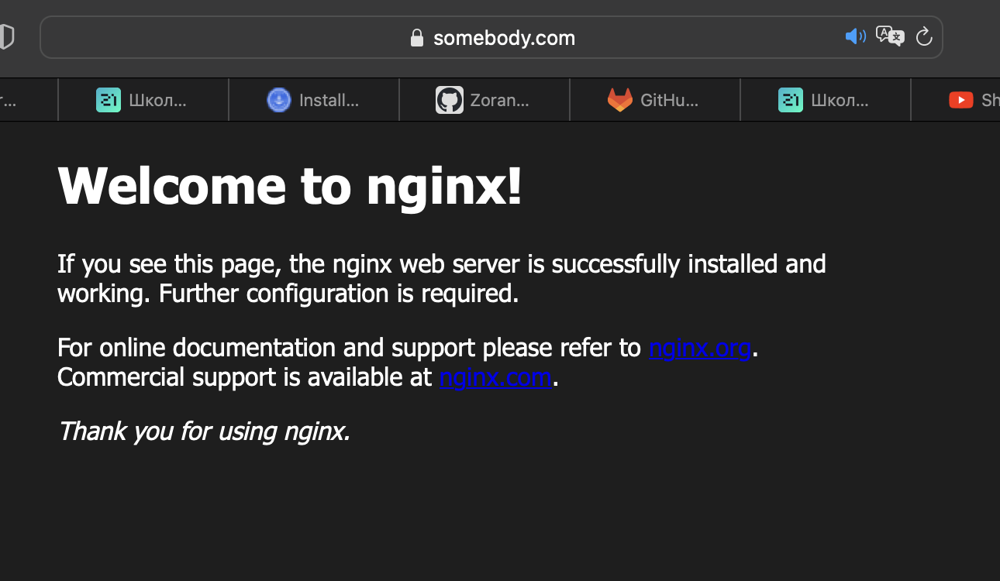

#### 6. So let's set up ingress and certmanager for our microservice application
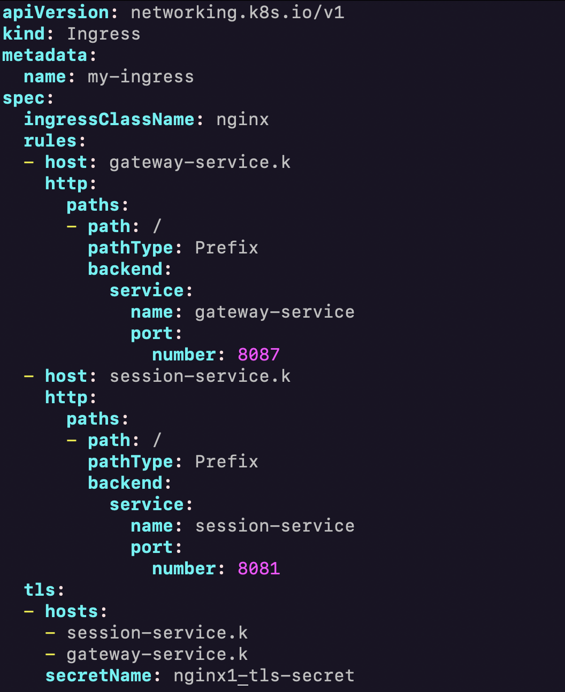
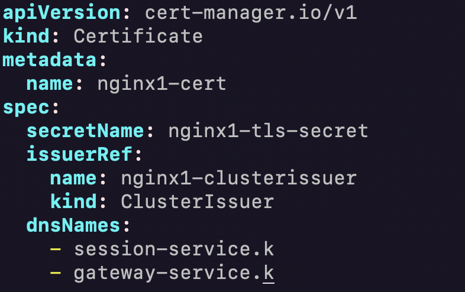
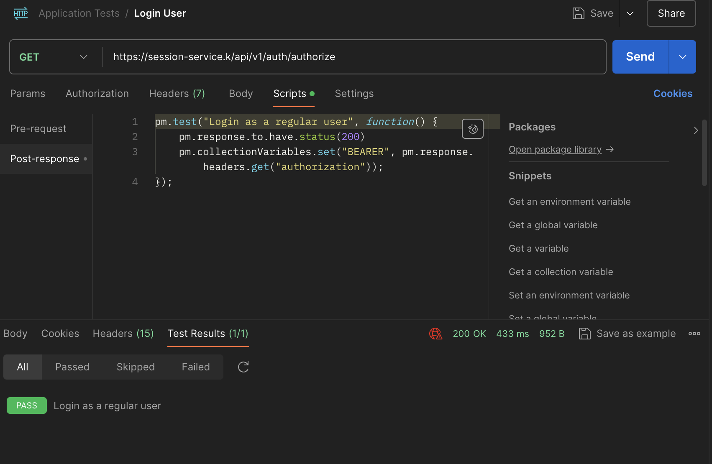
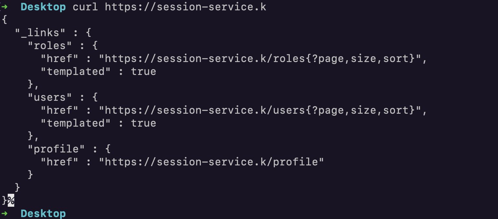

#### 7. Install and run Prometheus Operator to collect metrics in the system. Add the result of the kubectl get pods -n monitoringcommand in the report
1. Clone the Prometheus Operator repository
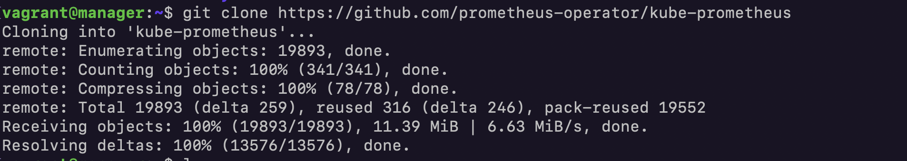
2. Create the namespace and CRDs, and then wait for them to be availble before creating the remaining resources
```bash
  sudo kubectl create -f manifests/setup
  until sudo kubectl get servicemonitors --all-namespaces ; do date; sleep 1; echo ""; done
  sudo kubectl create -f manifests/
```
3. Get created resources
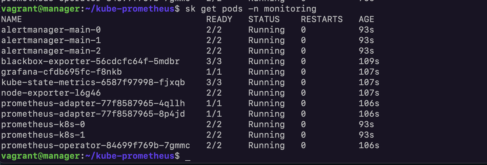